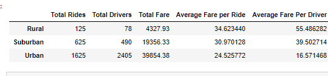
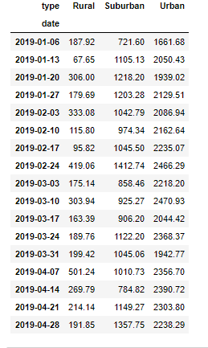
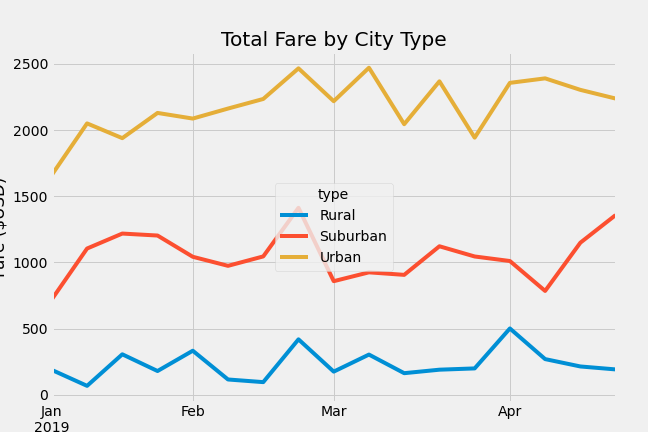

# Pyber_Analysis

## Overview of the analysis 
Explain the purpose of the new analysis.
In this project I was given a CSV file of ride sharing data for **Pyber**. Using Jupyter Notebook, Python, MatPlotlib, and Pandas I created charts and graphs to examine if the data differs from the city types. Also, looking at a specific 4-month period to get a snap shot of what the trends are in the data we created a graph to see if there are trends or not. 
## Results

As you can see from the chart and graph above the type of city does influence the total fares. Looking at the **Total Fare by City Type** we can see that urban city fares are 4 times greater than rural fares and 2 times more than suburban fares. Also, there is not a time where the data crosses where the ranking of the fare’s changes. This means that almost all the time you can expect Urban fares to be the most, second being suburban, and third being rural. One thing to be aware is that even though urban city types have more fares you can see that in the rural area the average fare per ride and average fare per driver is the highest among the three.
## Summary 
It looks like when it comes to the urban city types more drivers are a good thing because the number of total rides is way more than any other city type. Also, the average fare per ride in urban areas is less which means they are short trips and with more drivers there can be more fares. When it comes to rural drivers, although they average more per driver and ride, there is significantly fewer total rides. This shows that adding more drivers in that region will just decrease the average fares and the average fare per driver. Lastly, we can see that the end of February we can see that each city type has a sharp increase in total fares. So, having more drivers during this time can increase the total fares during that time.
